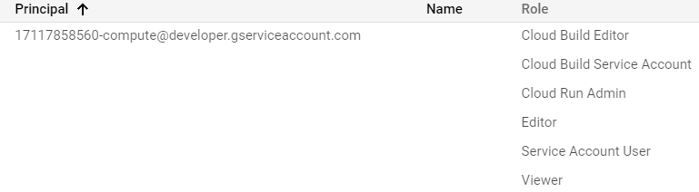

# NUS Fintech DevOps Project #2: CI/CD

App source code cloned from PC2- Toolkit #2 NUS Money Project: https://github.com/karlkws/nusmoney-b13g1

## Desired Outcome: 

### [Outcome #1] 


Pushing new commits = GitHub actions will automate notifications on: 
* Telegram channel (https://t.me/devops_karl)
* Twitter (https://twitter.com/devops_karl) 

Notification message will be comprised of commit datetime, commit message, and commit link to view code changes. 
<br>
### [Outcome #2]


Using GitHub actions: 
* Create Docker container and push to gcr.io
* Deploy to Google Cloud Run 

Live URL: 

https://devopskarl-rwdtppcoza-uc.a.run.app


## Steps Taken:

### 1. For Outcome #1

<b>(a) Link IFTTT to Telegram/Twitter</b>

- Telegram Bot to Telegram channel: https://help.ifttt.com/hc/en-us/articles/360003121113-How-to-get-started-using-IFTTT-with-Telegram

- IFTTT to Twitter account: https://ifttt.com/twitter

<br> 
<b>(b) Create Applet on IFTTT</b>
<br>
<br>


* Under "If", use Webhook service and set up trigger event name. 
* Under "Then", use Telegram/Twitter service and configure notification message. 

<br>
 
<b>(c) Obtain Webhook Key</b>

* Obtain from Webhook Documentation in https://ifttt.com/maker_webhooks.
* Set up as `IFTTT_KEY` in GitHub secrets. 

<br>

<b>(d) Set up workflow file (main.yaml)</b>

E.g. For telegram notification,

* Under steps, run: 


```
curl -X POST -H "Content-Type: application/json" -d '{"value1":"New push commit","value2":"${{ github.event.head_commit.message }}","value3":"${{ github.sha }}"}' https://maker.ifttt.com/trigger/notifytelegram/with/key/${{ secrets.IFTTT_KEY }}
```

 * where `github.event.head_commit.message` is the commit message and `github.sha` is the commit SHA (for commit's URL link).  


<br>
<br>
<br>

### 2. For Outcome #2

<b>(a) Set up Dockerfile for container</b>

* Use ubuntu 18.04 
* Modify COPY to include all the source code files to be copied to WORKDIR
* Modify RUN to npm install the required packages

<b>(b) Configuring Google Cloud Platform</b>

* Enable Cloud Build API and Cloud Run API on GCP
* Creating service account and setting role permissions

* Create Credential keys and export .json file

<b>(c) Set up GitHub secrets to be used in workflow file (deploy.yaml)</b>

* `GCP_APPLICATION` = application name
* `GCP_CREDENTIALS` = exported .json file from credential keys 
* `GCP_EMAIL` = service account email 
* `GCP_PROJECT` = project ID

<b>(d) Set up workflow deploy.yaml</b>

* Set up gcloud https://github.com/google-github-actions/setup-gcloud
* `gcloud auth configure-docker` configure Docker
* `gcloud builds submit` Submit build using Google Cloud Build
* `gcloud run deploy` deploy the container to GCR, `--allow-unauthenticated` for public access
