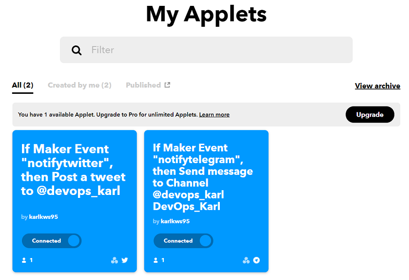

# NUS Fintech DevOps Project #2: CI/CD

## Desired Outcome: 

Pushing new commits = Automatic notification on: 
* Telegram channel (https://t.me/devops_karl)
* Twitter (https://twitter.com/devops_karl) 

Notification will contain datetime of commit, commit message, and direct link to the commit to view code changes. 


## Steps Taken:

### 1. Set up IFTTT Applet

<b>(a) Link IFTTT to Telegram/Twitter</b>

- Telegram Bot to Telegram channel: https://help.ifttt.com/hc/en-us/articles/360003121113-How-to-get-started-using-IFTTT-with-Telegram

- IFTTT to Twitter account: https://ifttt.com/twitter

<br> 
<b>(b) Create Applet</b>
<br>
<br>



Under "If", use Webhook service and set up trigger event name. 


Under "Then", use Telegram/Twitter service and configure notification message. 

<br>
 
<b>(c) Obtain Webhook Key</b>

Obtain from Webhook Documentation in https://ifttt.com/maker_webhooks.

Set up as IFTTT_KEY in Github Secrets. 

<br>

<b>(d) Set up workflow .yaml file</b>

under steps, run: (e.g. for telegram notification)


```
curl -X POST -H "Content-Type: application/json" -d '{"value1":"New push commit","value2":"${{ github.event.head_commit.message }}","value3":"${{ github.sha }}"}' https://maker.ifttt.com/trigger/notifytelegram/with/key/${{ secrets.IFTTT_KEY }}
```

where `github.event.head_commit.message` is the commit message and `github.sha` is the commit SHA (for commit's URL link).  
